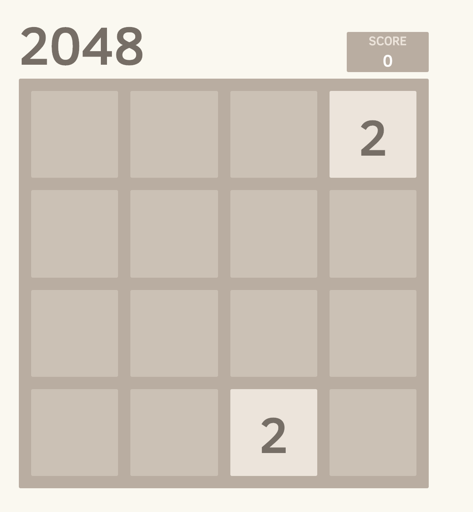
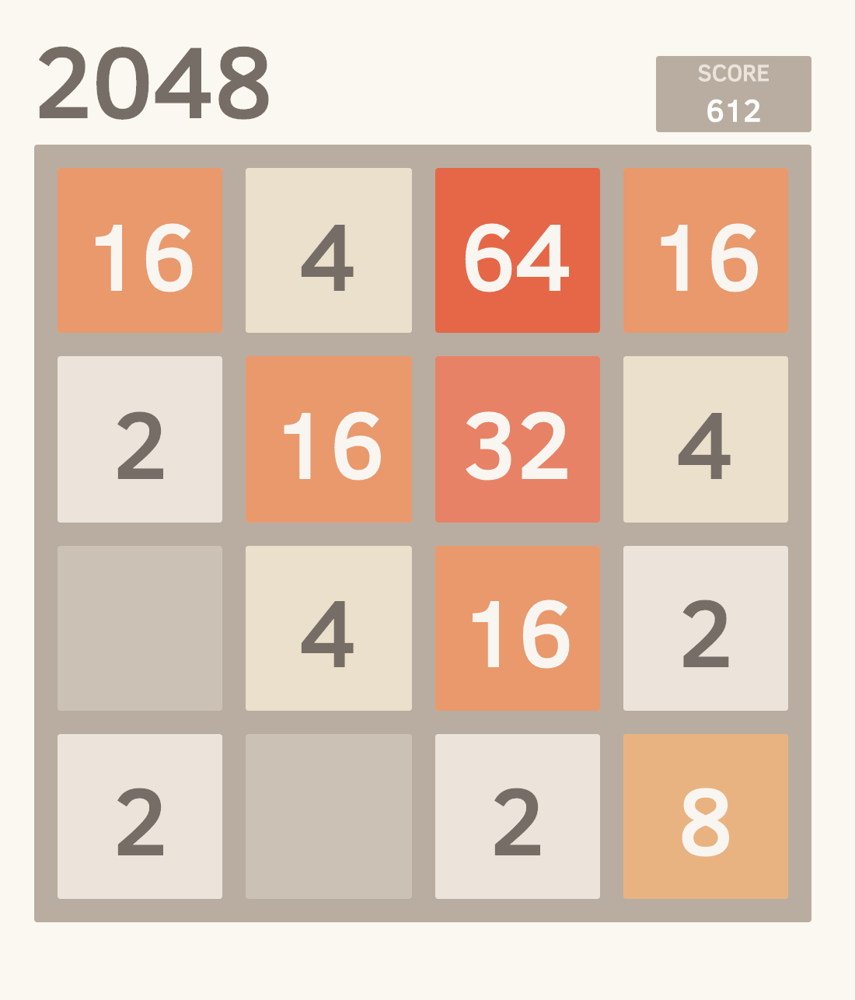

# 2048 Remake

This is a remake of the original 2048 game (https://play2048.co/). This project exercises JavaScript classes, closures, callbacks, as well as template literals and OOP design. Further, this project was a practice in fundamental JavaScript design patterns, including the Module pattern, the Constructor Pattern, and the Revealing Module Pattern. This project also utilizes semantic HTML, as well as advanced CSS techniques which include animations. 

Game state images: 

## Game States 

## Game Over State

